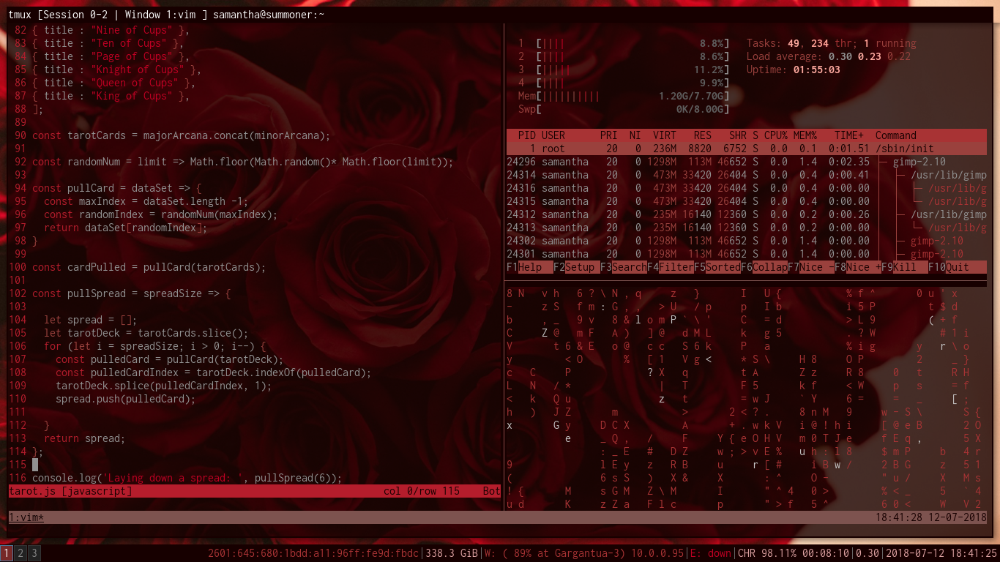

tildeslash
===========

https://github.com/HearMeRawr/tildeslash

`tildeslash` is my personal dotfiles for Linux.

Currently, it's dependencies are:

```
i3-gaps
compton
termite
feh
```

It looks like this:



Installing the dotfiles
-----------------------

```
git clone https:/github.com/HearMeRawr/tildeslash.git 
```

Copy out each file to it's proper location outside of tildeslash.
